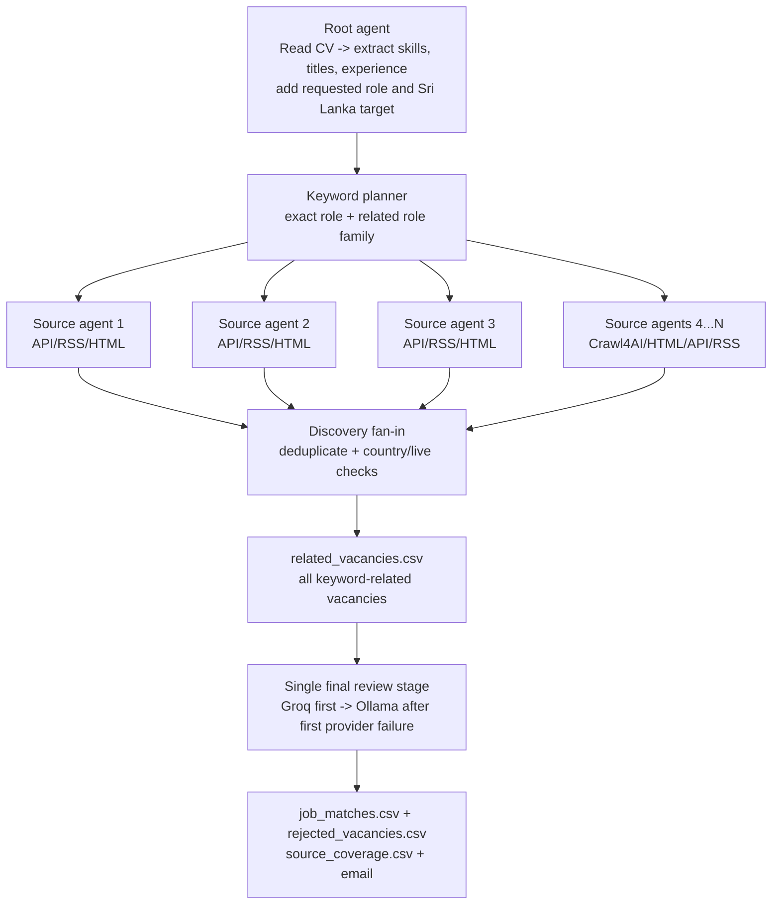

# Concurrent job-agent architecture

The runtime uses concurrent source discovery followed by a single final LLM gate.
Each source agent receives the same immutable candidate profile and target-role
keywords. No source agent can discard another source's results.

## State passed vertically

Every source node receives:

- parsed CV text, verified skills, and likely job titles;
- user-entered target position and maximum experience;
- normalized target country;
- per-source result limit and remote/discovery policy;
- its own isolated audit state.

Every source node returns:

- normalized jobs with evidence URLs and fetch timestamps;
- a completed, zero-unverified, skipped, or failed audit trace.

The fan-in stage preserves raw discovery in `all_discovered_jobs.csv`, applies broad
keyword, country, and live-page checks, and writes every candidate to
`related_vacancies.csv`. Those discovery files are checkpointed before model calls.
Only then does one strict LLM stage compare every candidate with the complete
extracted CV and write accepted rows to `job_matches.csv`. Groq handles normal
batches for speed. Its first quota, network, provider, or invalid-output failure
opens a per-run circuit breaker; the failed and remaining rows move to serialized,
one-vacancy Ollama calls while completed Groq decisions remain intact.

## Connector policy

Official APIs and structured public inventories are preferred because they expose
more complete data. Crawl4AI and bounded HTML crawling are used for JavaScript or
unstructured portals. Each website is represented by its own `SourceAgent`;
connector choice does not change the graph contract.

Complete ITPro, TopJobs, and XpressJobs inventories are cached briefly and then
filtered locally for each requested role. Source agents still run concurrently.

## Failure and coverage semantics

A website failure is isolated and recorded, then the graph continues. The final
reports distinguish `completed_with_results`,
`completed_inventory_no_role_candidates`, `connector_empty_unverified`, `skipped`,
and `failed`. A zero from a connector never claims that the website itself has no
vacancies.

"All Sri Lankan jobs" cannot be guaranteed: listings behind authentication, robots
restrictions, CAPTCHAs, private APIs, or unindexed pages may be unavailable. Coverage
is reported as auditable source coverage rather than an unsupported completeness
claim.
